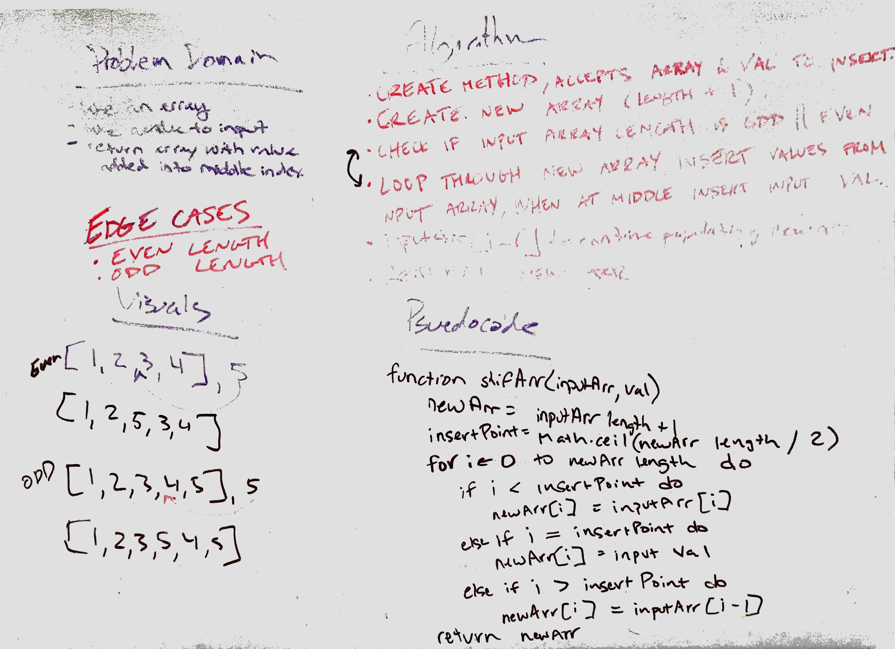

# Insert Shift Array

## Challenge
Given an array, insert a value into the middle of the array.

## Approach and Efficiency
Since you can't add to or subtract from an array in Java, I decided to create a new array based on the length of the input array + 1. From there I would create a variable to store the midway point of the input array by dividing the length in half. I would then loop through my new array and do conditional checks of i against the insert point to determine wheter I'm copying the value from the input array or inserting the insert value. once the insert value is inserted into the array, i will then do an additional conditional check to insert the value from input array at i - 1. this will allow me to continue building out my new array with the values from the input array without causing errors. 

## Solution 
[Code](../../src/main/java/code401Challenges/ArrayShift.java)
